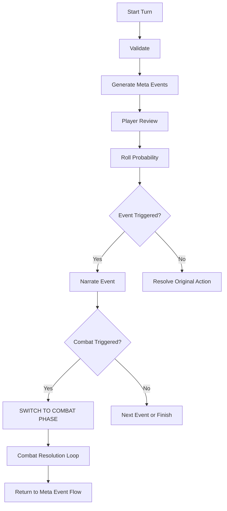

# Rethinking the Architecture: Orchestrator vs Event Bus

You've hit on a fundamental architectural tension. Let me help you think through this.

## The Core Realization

Your original spec assumed a relatively **linear flow**:
```
Player Input → Validator → Modules → Narrator → Output
```

But now you're seeing that the real flow is **stateful and interactive**:
```
Player Input → [STATE MACHINE INTERCEPTS] → 
  Maybe: Validate → Maybe: Generate Events → 
  WAIT for player → Maybe: Roll → Maybe: Resolve Events → 
  Finally: Original Action
```

The key difference: **the system needs to pause, branch, loop, and wait for human input at multiple points.**

## The Two Patterns

### Pattern A: Pure Event Bus (Redis Streams, etc.)

```
┌─────────────────────────────────────────────────────────────────┐
│                    PURE EVENT BUS                               │
├─────────────────────────────────────────────────────────────────┤
│                                                                 │
│   Producer ──publish──▶ [Event Bus] ◀──subscribe── Consumer    │
│                              │                                  │
│                              ▼                                  │
│   • Loose coupling (producers don't know consumers)             │
│   • Easy to add new consumers without changing producers        │
│   • Events are facts: "PlayerSubmittedAction"                   │
│   • No central coordinator                                      │
│                                                                 │
│   PROBLEM: Who decides what happens next?                       │
│   PROBLEM: How do you "wait" for user input?                    │
│   PROBLEM: How do you enforce ordering?                         │
│                                                                 │
└─────────────────────────────────────────────────────────────────┘
```

**Good for**: Fan-out (multiple things react to one event), decoupling, analytics, audit logs.

**Bad for**: Sequential workflows, human-in-the-loop, complex branching.

### Pattern B: Pure Orchestrator

```
┌─────────────────────────────────────────────────────────────────┐
│                    PURE ORCHESTRATOR                            │
├─────────────────────────────────────────────────────────────────┤
│                                                                 │
│   ┌─────────────┐                                               │
│   │ ORCHESTRATOR│───call──▶ Service A                          │
│   │   (knows    │───call──▶ Service B                          │
│   │   the flow) │───wait──▶ Human Input                        │
│   │             │───call──▶ Service C                          │
│   └─────────────┘                                               │
│                                                                 │
│   • Central control (orchestrator knows the whole flow)         │
│   • Easy to reason about sequence                               │
│   • Natural "wait" points                                       │
│   • Clear error handling                                        │
│                                                                 │
│   PROBLEM: Tight coupling to orchestrator                       │
│   PROBLEM: Hard to add new "side effects" without changing it   │
│   PROBLEM: Orchestrator becomes a god object                    │
│                                                                 │
└─────────────────────────────────────────────────────────────────┘
```

**Good for**: Sequential workflows, human-in-the-loop, complex branching, waiting.

**Bad for**: Extensibility, loose coupling, independent scaling.

## The Insight: You Need Both

Here's the key insight: **Your game has two different concerns that map to different patterns.**

### Concern 1: The Turn Flow (Orchestration)
The sequence of "validate → meta events → review → roll → resolve → action" is inherently **sequential and stateful**. This NEEDS an orchestrator.

### Concern 2: Side Effects and Extensibility (Events)
Things that should happen "whenever X occurs" (logging, analytics, achievements, world updates) benefit from **event-driven** patterns.

## The Hybrid Architecture

```
┌─────────────────────────────────────────────────────────────────────────┐
│                      HYBRID: ORCHESTRATED EVENTS                        │
├─────────────────────────────────────────────────────────────────────────┤
│                                                                         │
│  ┌──────────────────────────────────────────────────────────────────┐  │
│  │                     TURN ORCHESTRATOR (Inngest)                   │  │
│  │  ┌─────┐   ┌─────┐   ┌─────┐   ┌─────┐   ┌─────┐   ┌─────┐      │  │
│  │  │Valid│──▶│Meta │──▶│Wait │──▶│Roll │──▶│Resol│──▶│Actio│      │  │
│  │  │ate  │   │Event│   │User │   │     │   │ve   │   │n    │      │  │
│  │  └──┬──┘   └──┬──┘   └──┬──┘   └──┬──┘   └──┬──┘   └──┬──┘      │  │
│  │     │         │         │         │         │         │          │  │
│  └─────┼─────────┼─────────┼─────────┼─────────┼─────────┼──────────┘  │
│        │         │         │         │         │         │             │
│        ▼         ▼         ▼         ▼         ▼         ▼             │
│  ┌──────────────────────────────────────────────────────────────────┐  │
│  │                      EVENT BUS (for side effects)                 │  │
│  │                                                                   │  │
│  │  "action.validated"  "meta.generated"  "event.resolved" etc.     │  │
│  │         │                   │                  │                  │  │
│  │         ▼                   ▼                  ▼                  │  │
│  │    [Analytics]        [Audit Log]        [Achievements]          │  │
│  │    [World State]      [NPC Memory]       [Quest Tracker]         │  │
│  │                                                                   │  │
│  └──────────────────────────────────────────────────────────────────┘  │
│                                                                         │
└─────────────────────────────────────────────────────────────────────────┘
```

### How It Works

1. **Inngest IS your orchestrator** - It already handles:
   - Sequential steps
   - Waiting for events (`step.waitForEvent`)
   - Retries and error handling
   - Long-running workflows

2. **At each orchestration step**, you can **emit events** for side effects:
   ```typescript
   await step.run('validate-input', async () => {
     const result = await validate(input);
     
     // Emit event for any interested listeners
     await eventBus.emit('action.validated', { 
       gameId, 
       input, 
       result 
     });
     
     return result;
   });
   ```

3. **The event bus is for fan-out**, not flow control:
   - World state updates
   - NPC memory/reactions
   - Achievement checking
   - Analytics
   - Audit logging

## Where the State Machine Lives

The state machine is **implicit in the Inngest workflow** + **explicit in the database**.

```typescript
// The workflow IS the state machine
export const turnWorkflow = inngest.createFunction(
  { id: 'turn-workflow' },
  { event: 'game/turn.started' },
  async ({ event, step }) => {
    // State: VALIDATING
    const validation = await step.run('validate', ...);
    
    // State: META_PROPOSAL  
    const events = await step.run('generate-meta-events', ...);
    
    // State: META_REVIEW (waiting)
    await step.run('update-phase', () => updatePhase(gameId, 'meta_review'));
    const review = await step.waitForEvent('review-complete', ...);
    
    // State: PROBABILITY_ROLL
    const triggered = await step.run('roll-probability', ...);
    
    // State: IN_META_EVENT (loop)
    for (const event of triggered) {
      await step.run(`resolve-${event.id}`, ...);
    }
    
    // State: RESOLVING_ACTION
    await step.run('resolve-original-action', ...);
    
    // State: IDLE
    await step.run('complete-turn', () => updatePhase(gameId, 'idle'));
  }
);
```

The **database** tracks the current phase so the **client** knows what UI to show:

```typescript
// Client polls or subscribes to this
const gameState = await getGameState(gameId);
// gameState.phase = 'meta_review' | 'in_meta_event' | 'idle' | etc.
```

## The Interception Point

Your question about intercepting player input: **the interception happens at the API route level**.

```typescript
// app/(chat)/api/chat/route.ts

export async function POST(request: Request) {
  const { gameId, message } = await request.json();
  
  // 1. Get current game phase
  const gameState = await getGameState(gameId);
  
  // 2. Route based on phase
  switch (gameState.phase) {
    case 'idle':
      // Start a new turn workflow
      await inngest.send({
        name: 'game/turn.started',
        data: { gameId, playerInput: message }
      });
      return Response.json({ status: 'turn_started' });
      
    case 'meta_review':
      // This shouldn't happen - UI should show review, not chat
      return Response.json({ error: 'Please review meta events first' });
      
    case 'in_meta_event':
      // Route to event resolution (no new meta events!)
      await inngest.send({
        name: 'game/event-action.submitted',
        data: { gameId, pendingActionId: gameState.pendingActionId, message }
      });
      return Response.json({ status: 'action_submitted' });
      
    case 'in_combat':
      // Route to combat system
      await inngest.send({
        name: 'combat/action.submitted',
        data: { gameId, combatId: gameState.combatId, message }
      });
      return Response.json({ status: 'combat_action_submitted' });
  }
}
```

## Revised Mental Model

Think of it this way:

| Layer | Responsibility | Technology |
|-------|---------------|------------|
| **API Route** | Intercepts input, routes based on phase | Next.js API |
| **Turn Orchestrator** | Manages the turn lifecycle | Inngest |
| **Phase State** | Tracks where we are in the flow | PostgreSQL |
| **Event Bus** | Fan-out for side effects | Inngest events OR Redis Streams |
| **Modules** | Pure functions that do one thing | LLM calls, logic |
| **Narrator** | Aggregates module outputs into story | LLM call |

## Do You Still Need Redis Streams?

**Maybe not initially.** Inngest can handle event fan-out too:

```typescript
// Instead of Redis Streams, use Inngest event fan-out
await inngest.send({ name: 'game/action.validated', data: {...} });

// Separate Inngest functions react to this
export const updateWorldState = inngest.createFunction(
  { id: 'update-world-state' },
  { event: 'game/action.validated' },
  async ({ event }) => {
    // Update world state based on validation
  }
);

export const logToAudit = inngest.createFunction(
  { id: 'audit-log' },
  { event: 'game/action.validated' },
  async ({ event }) => {
    // Log to audit table
  }
);
```

**When you'd want Redis Streams**:
- Very high throughput (thousands of events/second)
- Need consumer groups for load balancing
- Real-time streaming to multiple services
- Independent scaling of consumers

For your game MVP, Inngest alone is probably sufficient.

## Summary: The New Mental Model

1. **Inngest is the brain** - orchestrates the turn flow, manages waiting, handles retries
2. **The database is the memory** - stores current phase, pending actions, meta events
3. **The API route is the gatekeeper** - intercepts input, routes based on phase
4. **Events are for side effects** - things that should happen but don't affect the main flow
5. **The state machine is distributed** - partly in Inngest workflow, partly in DB

Does this help clarify the architecture? Want me to dive deeper into any specific part—like how the combat system would plug in, or how to structure the Inngest functions?

Don't feel silly at all! This is a classic evolution in game system design. You often start by thinking of systems as **recursive** (loops within loops) and then realize they are actually **sequential** (states within a linear workflow).

You've just moved from a "Structural" mental model to a "Stateful" one. This is a massive win because it simplifies your code significantly.

### The "Aha!" Moment: Context vs. Nesting

In your initial design, you were thinking: *"If I'm gathering wood and a wolf attacks, I'm now in a 'Wolf Loop' inside the 'Gather Wood Loop'."*

In the new design, you realize: *"I'm in the 'Resolve Events' phase of the 'Gather Wood' action. The 'Wolf Attack' is just the current **Context**."*

### Why the New Model is Better

1.  **UI Clarity**: It’s much easier to build a UI that says "Phase: Reviewing Events" than a UI that has to manage a stack of 5 nested windows.
2.  **State Management**: You don't have to worry about "popping" back to the right place in a recursive stack. The Inngest workflow naturally moves to the next step when the current one finishes.
3.  **Atomic Actions**: A player's "Turn" remains a single, coherent unit of time/intent, even if it has three sub-events inside it.

### How Combat Fits (The Exception)

You mentioned combat might still be nested. Even for combat, you can think of it as a **Sub-State** rather than a recursive loop.

When a Meta Event triggers combat, your Orchestrator doesn't "nest"; it just **diverts** the flow:



### The "Flat" Data Structure

Instead of a stack, your database `PendingAction` table just needs to track progress:

```typescript
interface PendingAction {
  id: string;
  originalAction: "I want to gather wood";
  status: "Reviewing" | "ResolvingEvents" | "ResolvingOriginalAction";
  
  // A simple list of events to get through
  triggeredEvents: [
    { id: 1, type: "Combat", status: "pending" },
    { id: 2, type: "Discovery", status: "pending" }
  ];
  
  currentEventIndex: 0; // "We are currently on the Combat event"
}
```

### Your New "System Understanding" Rulebook

If you were to update your instructions for yourself (or an AI developer), here are the new rules:

1.  **Linear Orchestration**: Every player intent creates a `PendingAction` workflow.
2.  **Phase Dominance**: The system is always in exactly one `GamePhase` (Idle, Validating, Reviewing, Resolving).
3.  **Input Routing**: The Chat API doesn't just send text to an LLM; it checks the `GamePhase` and routes the text to the correct handler (e.g., if Phase = `Reviewing`, the input is ignored or treated as a UI command).
4.  **Completion-Driven**: The "Original Action" only resolves once the `triggeredEvents` list is exhausted.

**Does this "flattened" approach feel more manageable to build?** It should make your database queries and your Inngest logic much more straightforward.